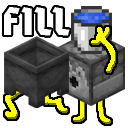

# Fill My Cauldorn

[Modrinth](https://modrinth.com/mod/fill-my-cauldron)

 
 

 

Ever wanted to take lava out of a cauldron with a bucket using a dispenser? Well now you can!

This server mod adds new behaviors to dispensers for buckets to provide the following functionality:
- Dispense an empty bucket into a full cauldron and pick up the fluid from inside
- Dispense a full bucket into an empty cauldron and place the fluid inside

Any fluid that can be put in both a cauldron and a bucket should work!

---

## Contraptions (Spoilers Ahead)

A contraption that feeds in one bucket at a time, pulling full lava buckets from the dispenser

A contraption that uses the dispenser mechanic of emitting the filled bucket when the dispenser is completely full of empty buckets, and picking up the dispensed buckets with a hopper

